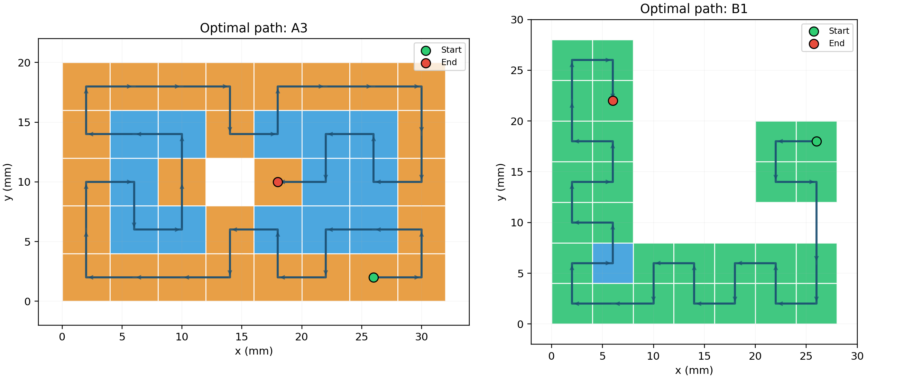
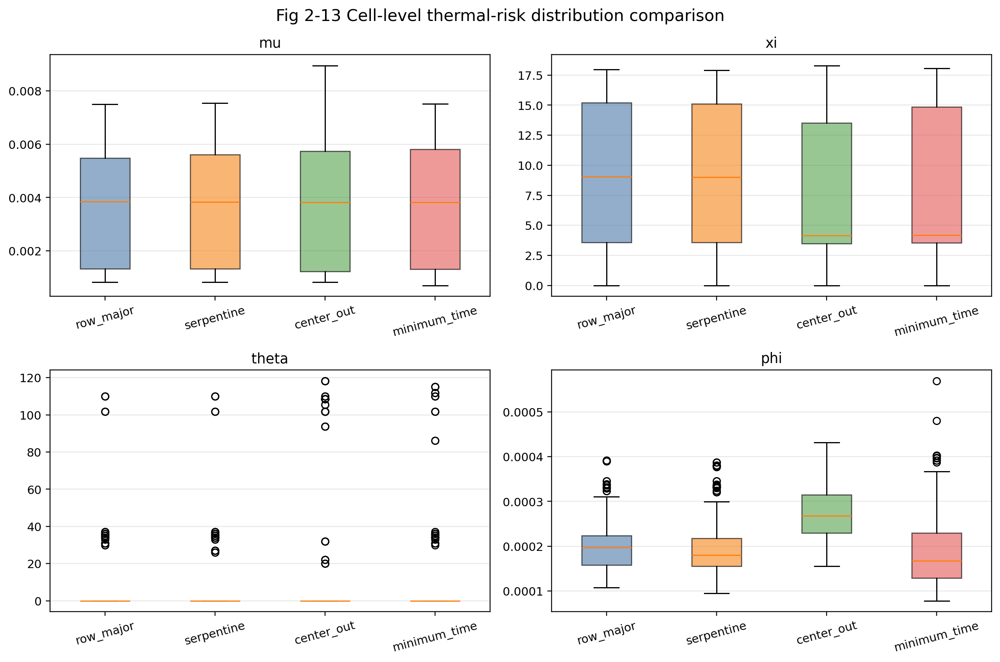

# 2026年第十九届“认证杯”数学中国数学建模网络挑战赛 - C题：智能增材制造路径优化

**参赛队号：** 5868  
**项目名称：** 基于多目标优化的激光扫描路径设计算法研究  

本仓库包含我们提交至2026年“认证杯”数学建模网络挑战赛（C题）的完整源代码、原始数据集、数学模型、可视化脚本以及最终的LaTeX排版论文。

本项目旨在解决激光粉末床熔融（LPBF）增材制造中极其关键的激光扫描路径规划问题。我们的核心目标是在时间效率（最小化空走距离）与热力学成形质量（缓解局部热积累）之间取得最佳平衡。

---

## 1. 项目概述

激光粉末床熔融（LPBF）技术通过将零件切片为离散的薄层并逐层熔化粉末来进行制造。扫描路径不仅决定了制造时间，还深刻影响着零件的热历程。不合理的路径规划通常会导致两种主要的失效模式：

* **效率低下：** 过多的“空走”（激光在不熔化材料的情况下的空间移动）会显著延长打印时间。
* **热致变形：** 相邻区域在短时间内受到高频重复加热会导致局部热量急剧积累，进而引发残余应力、翘曲变形甚至开裂。

本项目开发了一个**多目标优化框架**以解耦上述问题。我们首先运用精确的图论算法确立了单层制造时间的理论下界；随后，构建了一个多维度的热力学风险评估模型，以量化评估不同材料和约束条件下各类扫描策略的热安全性。

---

## 2. 方法论与核心算法

### 第一部分：时间降维解耦的路径优化（问题一）

为了孤立并最小化空走时间，我们将总制造时间在结构上解构为三个部分：恒定的扫描时间、恒定的激光开启延迟以及可变的空走时间。

* **问题建模：** 我们将单层路径规划在数学上严格转化为完全图上的**开放式旅行商问题（Open TSP）**，其中边权代表单元间的空走距离。
* **精确求解器实现：** 通过引入一个带有零权边的虚拟节点（V<sub>0</sub>），我们将开放式路径转化为闭环回路，从而实现精确求解。模型基于**0-1整数规划**，并通过Google OR-Tools调用**分支定界法（Branch-and-Bound）**进行求解。
* **算法性能：** 与工业界标准的“顺序扫描（Row Major）”策略相比，我们的最优路径将总空走距离缩短了约 44.4%，从而为给定的层几何拓扑确立了理论最小时间下界。

> *示例可视化：最优路径拓扑*
> 

### 第二部分：热力学风险评估（问题二）

为了全面评估任意路径可能引发的热力学后果，我们开发了一个综合的风险评估模型。

* **物理模型修正：** 我们对基准的指数衰减热贡献模型进行了修正，从物理机制上区分了自热强度与邻域传热强度，并引入了单元质量、比热容及共享边界长度等物理参数。
* **阈值对齐：** 我们以“顺序扫描”策略为基准锚点，运用统计学中的**分位数对齐法（Quantile Alignment）**，在修正后的物理模型下重新标定了过热阈值（H<sub>thres</sub>）。
* **四维风险指标：** 我们从四个相互正交的维度对每个扫描单元进行评估：局部高温指数、热循环影响指数、成型不稳定性指数以及邻域热分布不均匀性指数。
* **综合评价：** 模型底层采用**熵权法（Entropy Weight Method）**客观确定内部特征权重，顶层结合**TOPSIS（理想解相似度顺序偏好法）**，将时间最优路径与各基准策略的整体热安全性进行量化排序。

> *示例可视化：单元格热风险对比*
> 

### 第三部分：全面的灵敏度分析

为验证模型的鲁棒性，我们进行了严谨的灵敏度测试：

* **硬件动力学：** 考察了不同空走速度（1200–2400 mm/s）与激光开启延迟波动的系统响应。
* **边界约束条件：** 分析了在固定起点、固定终点以及强制回仓规则下，最优路径拓扑的重排机制与时间惩罚。
* **材料敏感性：** 在五种工业典型材料（PA12, 316L不锈钢, Ti-6Al-4V, AlSi10Mg, Inconel 718）下验证了热风险模型的泛化能力。
* **主观偏好场景：** 测试了在不同决策者偏好（例如：极端规避热循环 vs 优先保证全局热均匀性）下，TOPSIS排序结果的绝对刚性。

---

## 3. 仓库目录结构

本仓库的目录结构与竞赛问题及我们的分析工作流严格对应。

| 目录 / 文件 | 描述 |
| :--- | :--- |
| `C_data/` | 竞赛原始数据集，包含几何拓扑与物理参数文件。 |
| `question_1/` | 包含时间最优路径规划（Open TSP）求解模型及针对结构性边界约束的灵敏度分析代码。 |
| `question_2/` | 包含热力学风险评估脚本、分位数对齐逻辑以及跨材料的TOPSIS综合评价代码。 |
| `latex/` | 论文最终版本的完整LaTeX源代码。 |
| `假设.md` | 本项目所有核心数学假设的详细文档与物理解释。 |
| `5868队 C题.pdf` | 最终提交的65页完整参赛论文。 |

---

## 4. 运行指南与复现

### 依赖环境

核心优化求解与可视化脚本需要Python环境及以下依赖库：

```bash
pip install ortools matplotlib openpyxl
```

### 模型运行说明

* **时间最优路径求解（问题一）：** 导航至 `question_1/basic_model_result_for_question_1/` 并运行 `basic_model_for_question_1.py`。该脚本将输出包含最优访问序列与时间日志的基础JSON及CSV文件。

* **热力学风险评估（问题二）：** 请确保问题一的输出文件已生成。导航至 `question_2/basic_model_for_question_2/` 并运行 `basic_model_for_question_2.py`。该脚本将计算空间热分布演化并输出综合TOPSIS得分。

* **可视化图表生成：** 用于生成论文插图（如拓扑路径图、时间分解图、热力学映射图等）的专用Python脚本均位于 `question_1` 与 `question_2` 各自的 `visualization` 子目录中。

## 5. 结论与工程意义

我们的分析清晰地揭示了LPBF路径规划中极其关键的帕累托前沿（Pareto Frontier）。算法推导出的“时间最优路径”确立了制造速度的绝对物理极限，但不可避免地诱发了严重的局部热过载。相反，如“蛇形扫描（Serpentine）”等结构化工业策略虽牺牲了部分时间效率，却提供了卓越的空间热耗散与温度均匀性。

本仓库提供的多目标评估框架，能够有效辅助增材制造工程师基于特定材料的热容限与实际产能约束，精确量化这些权衡并选择最优的路径策略。有关数学推导细节与更深度的工程结论，请参阅最终提交的论文（`5868队 C题.pdf`）。


# 2026 Mathematical Contest in Modeling (Authority Cup) - Problem C: Intelligent Additive Manufacturing Path Optimization

**Team Number:** 5868  
**Project Title:** Research on Laser Scanning Path Design Algorithm Based on Multi-Objective Optimization  

This repository contains the complete source code, raw datasets, mathematical models, visualization scripts, and the final LaTeX manuscript for our submission to the 2026 Mathematical Contest in Modeling (Authority Cup) - Problem C. 

The project addresses the critical challenge of laser scanning path planning in Laser-Powder Bed Fusion (LPBF) additive manufacturing. We aimed to balance time efficiency (minimizing idle travel) with thermodynamic forming quality (mitigating local heat accumulation).

---

## 1. Project Overview

Laser-Powder Bed Fusion (LPBF) involves slicing a component into discrete layers and melting powder sequentially. The scanning path dictates both the manufacturing time and the thermal history of the part. Improper path planning leads to two primary failure modes:

* **Inefficiency:** Excessive "idle travel" (laser repositioning without melting) significantly extends printing time.
* **Thermal Deformation:** Repeated, high-frequency heating of adjacent regions causes localized heat accumulation, leading to residual stress, warping, or cracking.

This project develops a Multi-Objective Optimization Framework to decouple these issues. We first established a theoretical lower-bound for single-layer manufacturing time using exact graph theory algorithms. Subsequently, we constructed a multi-dimensional thermodynamic risk evaluation model to assess the thermal safety of various scanning strategies across different materials and constraints.

---

## 2. Methodology & Core Algorithms

### Part I: Time-Decoupled Path Optimization (Question 1)

To isolate the idle travel time, we structurally decomposed the total manufacturing time into three components: constant scanning time, constant laser-on delay, and variable idle travel time. 

* **Problem Formulation:** The layer path planning was mathematically formulated as an Open Traveling Salesman Problem (TSP) on a fully connected graph where edge weights represent idle travel distances.
* **Exact Solver Implementation:** We introduced a dummy node (V<sub>0</sub>) with zero-weight edges to convert the open path into a closed loop, allowing for an exact solution. The model was solved using 0-1 Integer Programming and the Branch-and-Bound algorithm via Google OR-Tools. 
* **Performance:** Our optimal path reduced the total idle travel distance by approximately 44.4% compared to the standard industrial "Row Major" strategy, establishing a theoretical minimum for the given layer geometries.

> *Example Visualization: Optimal Path Topology*
> 

### Part II: Thermodynamic Risk Evaluation (Question 2)

To evaluate the thermal consequences of any given path, we developed a comprehensive risk assessment model.

* **Physical Model Correction:** We refined the baseline exponential decay heat contribution model by separating self-heating intensity from neighborhood conduction intensity. We incorporated physical parameters including unit mass, specific heat, and shared boundary lengths.
* **Threshold Alignment:** We utilized a statistical quantile alignment method using the "Row Major" strategy as a baseline to recalibrate the overheating threshold (H<sub>thres</sub>) under the modified physical model.
* **Four-Dimensional Risk Metrics:** We evaluated each unit across four orthogonal indices: Local High Temperature, Thermal Cycling Shock, Forming Instability, and Neighborhood Thermal Discrepancy.
* **Comprehensive Scoring:** We employed an Entropy Weight Method to objectively weigh internal features, coupled with TOPSIS (Technique for Order Preference by Similarity to Ideal Solution) to rank the overall thermal safety of baseline strategies against our Time-Optimal path. 

> *Example Visualization: Cell Risk Boxplots*
> 

### Part III: Extensive Sensitivity Analysis

To validate the robustness of our models, we conducted rigorous sensitivity testing:

* **Hardware Kinematics:** Varied travel speeds (1200–2400 mm/s) and laser-on delays.
* **Boundary Constraints:** Analyzed path topology rearrangement under fixed starting points, fixed endpoints, and strict depot-return rules.
* **Material Variability:** Validated the thermal risk model across five industrial materials (PA12, 316L Stainless Steel, Ti-6Al-4V, AlSi10Mg, Inconel 718).
* **Subjective Scenarios:** Tested the TOPSIS ranking stability under different decision-maker preferences, such as heavily penalizing thermal cycling versus prioritizing global uniformity.

---

## 3. Repository Structure

The repository is structured to map directly to the problem statements and our analytical workflow.

| Directory / File | Description |
| :--- | :--- |
| `C_data/` | Raw challenge datasets including geometry and physical parameters. |
| `question_1/` | Contains the Time-Optimal Path Planning (Open TSP) models and sensitivity analysis for structural boundary constraints. |
| `question_2/` | Contains the Thermodynamic Risk Evaluation scripts, quantile alignment logic, and multi-material TOPSIS scoring. |
| `latex/` | Complete LaTeX source code for the manuscript. |
| `假设.md` | Detailed documentation of all mathematical assumptions. |
| `5868队 C题.pdf` | Final Submitted Manuscript. |

---

## 4. Execution Guide & Reproduction
### Dependencies

The core optimization and visualization scripts require Python and the following libraries:

* `ortools`
* `matplotlib`
* `openpyxl`

### Running the Models

* **Time-Optimal Paths (Question 1):** Navigate to `question_1/basic_model_result_for_question_1/` and execute `basic_model_for_question_1.py`. This generates the foundational JSON and CSV files containing the optimal visiting sequences and time logs.
* **Thermodynamic Risk Evaluation (Question 2):** Ensure the outputs from Question 1 are present. Navigate to `question_2/basic_model_for_question_2/` and execute `basic_model_for_question_2.py`. This calculates the spatial heat distributions and comprehensive TOPSIS scores.
* **Visualizations:** Dedicated Python scripts for generating publication-ready charts are located in the `visualization` subdirectories of both `question_1` and `question_2`.

## 5. Conclusion & Engineering Implications

Our analysis reveals a critical Pareto frontier in LPBF path planning. The algorithmically derived Time-Optimal path establishes the absolute limit for manufacturing speed but induces severe localized thermal overloads. Conversely, structured industrial strategies like "Serpentine" sacrifice some time efficiency but provide superior spatial heat dissipation.

The framework provided in this repository allows manufacturing engineers to quantify these trade-offs and select the optimal pathing strategy based on specific material tolerances and production constraints. For a detailed discussion of the mathematical proofs and engineering conclusions, please refer to the final manuscript (`5868队 C题.pdf`).
